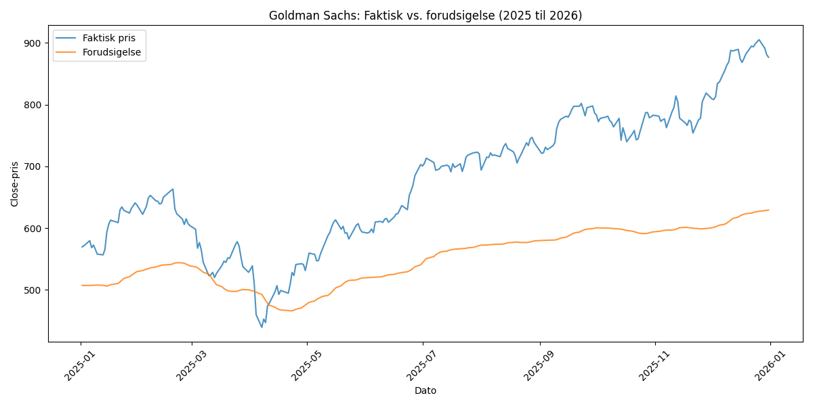

# Træningsresultater – Goldman Sachs aktieprisforudsigelse

**Genereret:** 2026-03-16 23:18:59

## Visualisering

## Træningsloss (bedste model)

| Loss | Værdi |
|---|---|
| **Train Loss** | 0.004600 |
| **Test MSE (facit)** | 0.065680 |

## Slutpris (sidste dag i testperioden)

| | Pris |
|---|---|
| **Forudsigelse** | 629.32 |
| **Faktisk** | 876.79 |
| **Fejl i %** | 28.22% |

## Første dag i testperioden

| | Pris |
|---|---|
| **Forudsigelse** | 507.43 |
| **Faktisk** | 569.74 |
| **Fejl i %** | 10.94% |

## Metrikker (hele testperioden)

| Metrik | Værdi |
|---|---|
| MSE | 0.0657 |
| MAE | 0.2288 |
| MAPE | 19.14% |
| Gns. fejl i % | 17.84% |
| Maks. fejl i % | 30.97% |
| Min. fejl i % | 0.44% |

## Træningsindstillinger

- Epoker (kørt): 2
- Learning rate: 0.0001
- Batch size: 8
- Sekvenslængde: 60 dage
- Antal forudsigelser: 250
- Testperiode: 2025-01-02 til 2025-12-31
