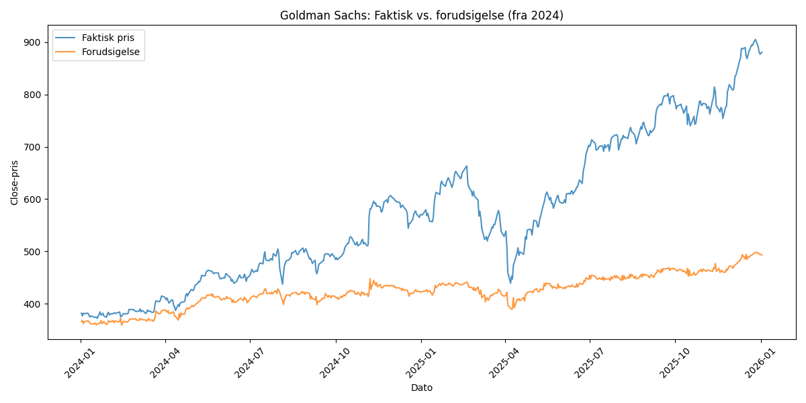

# Træningsresultater – Goldman Sachs aktieprisforudsigelse

**Genereret:** 2026-03-11 22:43:51

## Visualisering

## Slutpris (sidste dag i testperioden)

| | Pris |
|---|---|
| **Forudsigelse** | 493.17 |
| **Faktisk** | 880.75 |
| **Fejl i %** | 44.01% |

## Første dag i testperioden

| | Pris |
|---|---|
| **Forudsigelse** | 366.48 |
| **Faktisk** | 382.19 |
| **Fejl i %** | 4.11% |

## Metrikker (hele testperioden)

| Metrik | Værdi |
|---|---|
| MSE | 0.2536 |
| MAE | 0.4033 |
| MAPE | 24.61% |
| Gns. fejl i % | 22.73% |
| Maks. fejl i % | 45.40% |
| Min. fejl i % | 0.86% |

## Træningsindstillinger

- Epoker: 200
- Learning rate: 0.0002
- Batch size: 16
- Sekvenslængde: 60 dage
- Antal forudsigelser: 503
- Testperiode: 2024-01-02 til 2026-01-02
