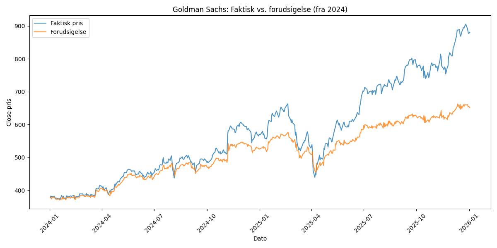

# Træningsresultater – Goldman Sachs aktieprisforudsigelse

**Genereret:** 2026-03-16 23:04:11

## Visualisering

## Slutpris (sidste dag i testperioden)

| | Pris |
|---|---|
| **Forudsigelse** | 651.43 |
| **Faktisk** | 880.75 |
| **Fejl i %** | 26.04% |

## Første dag i testperioden

| | Pris |
|---|---|
| **Forudsigelse** | 378.17 |
| **Faktisk** | 382.19 |
| **Fejl i %** | 1.05% |

## Metrikker (hele testperioden)

| Metrik | Værdi |
|---|---|
| MSE | 0.0543 |
| MAE | 0.1634 |
| MAPE | 9.42% |
| Gns. fejl i % | 8.74% |
| Maks. fejl i % | 27.10% |
| Min. fejl i % | 0.03% |

## Træningsindstillinger

- Epoker: 200
- Learning rate: 0.0001
- Batch size: 8
- Sekvenslængde: 60 dage
- Antal forudsigelser: 503
- Testperiode: 2024-01-02 til 2026-01-02
